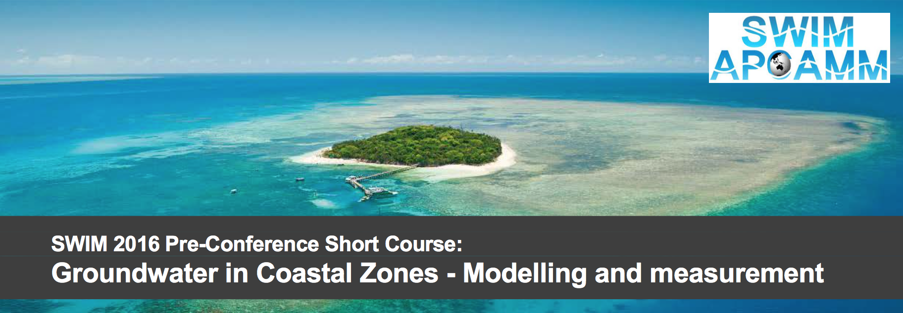

# SWIM2016 Pre-Conference Short Course GitHub Repository

This is the class GitHub repository for the pre-conference workshop taught at the [2016 SWIM-APCAMM meeting](http://www.plevin.com.au/swim2016/index.html).

Pre-Conference Workshop - Groundwater in Coastal Zones - Modelling and measurement.
Tues 28 June-Sat 2 July 2016
Course [link](http://www.groundwater.com.au/events/1109)

The course is organised by the National Centre for Groundwater Research and Training and will be held at Rydges Tradewinds Cairns, the venue for SWIM 2016.

Topics will include:
* Theory of variable-density flow and solute transport
* Sharp-interface analytical solutions
* FloPy, a Python tool for the MODFLOW code family
* MODFLOW SWI package
* SEAWAT

[Course Program](http://groundwater.com.au/documents/groundwater-modelling-in-coastal-zones-program.pdf)

[Course Presenters](http://groundwater.com.au/documents/swim-course-2016-presenter-biographies--2.pdf)

## Laptop Requirement
Each course participant is expected to arrive with a laptop computer that has the required software installed and tested according to the instructions presented here.  Laptop computers should be running a standard installation of either the Windows or Macintosh operating systems. Users should arrive with privileged account access, sometimes called a “PR account”, in the event that additional software installation is required.  Please coordinate with your IT group prior to arriving to the class.

## Software Requirements
We ask that you install and test the following software prior to showing up for the class.  Installers are located on a public ftp site.  A separate email was sent with instructions about software installation.  Please use the provided installers so that everyone is using the same version.

## Internet Availability
The classroom will have wireless Internet.  Those requiring access to the specific domains will need to establish a VPN connection.

## Exercises/Notebooks
Many of the beginning Python concepts will be taught using the Jupyter Notebook, which runs Python from a web browser.  We will also be running Python scripts using the command line and several other approaches.  

## Python Tutorial
For those with little or no Python experience, we request that you complete the online tutorial at Code Academy:
 
    http://www.codecademy.com/en/tracks/python
 
Suggested exercises:
* Python syntax
* Strings & Console Output
* Date and Time
* Conditionals and Control Flow
* Functions
* Python Lists and Dictionaries
* Lists and Functions*
* Loops
* Advanced Topics in Python
* Introduction to Classes
* Classes
* File Input/Output
 
Optional exercises:
* Tip Calculator
* PygLatin
* Taking a Vacation
* A Day at the Supermarket
* Student Becomes the Teacher
* Battleship
* Practice Makes Perfect
* Exam Statistics
* Introduction to Bitwise Operators

## Schedule

### Day 1
* Introduction to Python and Jupyter Notebooks
* Notebook -- Hand calculations of head and pressure (exHandCalculations_A)
* Presentation -- Analytical solutions and more
* Notebook -- Interface flow toward the coast (exAnalytic_A)
* Notebook -- More interface flow toward the coast (exAnalytic_B)

### Day 2
* Notebook -- A well near the coast (exAnalytic_C)
* Presentation -- SWI Package for MODFLOW
* Notebook -- Interface flow (exSWI_A)
* Notebook -- More interface flow (exSWI_B)
* Notebook -- Transient saltwater intrusion near wells (exSWI_C)

### Day 3
* Presentation -- SEAWAT concepts
* Notebook -- Hand calculations of head and pressure (exHandCalculations_A)
* Presentation -- Overview of Henry Problem
* Notebook -- Henry Problem (exA)
* Presentation -- Class problem
* Notebook -- Design, run, and calibrate 2D model (exC)

### Day 4
* Notebook -- Design and run 3D model (exD)
* Notebook -- Particle tracking with SEAWAT model (exD cont)
* Notebook -- Simulating effects of tides (exE)
* Notebook -- Simulating and quantifying SGD (exF)
* Notebook -- Solute and heat transport (exG)
* Presentation -- Next steps

